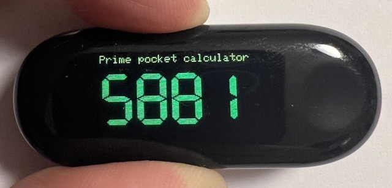
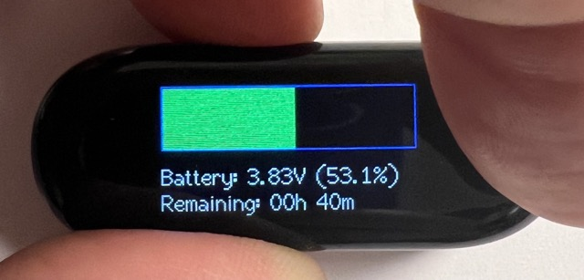

# Pocket Prime Number Generator using LillyGO T-Wristband

## What is this?

This program displays prime numbers on a [LilyGO Wristband](https://github.com/Xinyuan-LilyGO/T-Wristband), which uses a ESP32-PICO-D4 processor.

Notable features:

* It calculates the prime numbers on startup up-to 99,9999 (the display can only show 6 digits)
* When pressing the button it shows a graph with how much battery is left as well as it's level and percentage
* LED turns on when charging from USB
* It uses light sleep for improved power consumption

## Images of the project

The wristband showing the prime numbers:

And the percentage of battery left (by pressing the button):

## How to compile and run

Requirements:

* Make sure that you have [Visual Studio Code](https://code.visualstudio.com) installed
* Make sure that you have [Platform IO](https://platformio.org) installed
* Make sure you have [Espressif IDF](https://github.com/espressif/vscode-esp-idf-extension) extension installed

If you have all these installed, simply open the project in PlatformIO, hit the "build" and "upload" buttons. Please refer to the documentation on how to properly connect the programmer to the band:

* [Product Page](http://www.lilygo.cn/prod_view.aspx?TypeId=50054&Id=1242)
* [Github Page](https://github.com/Xinyuan-LilyGO/T-Wristband)

## License

[Apache 2.0](LICENSE)
